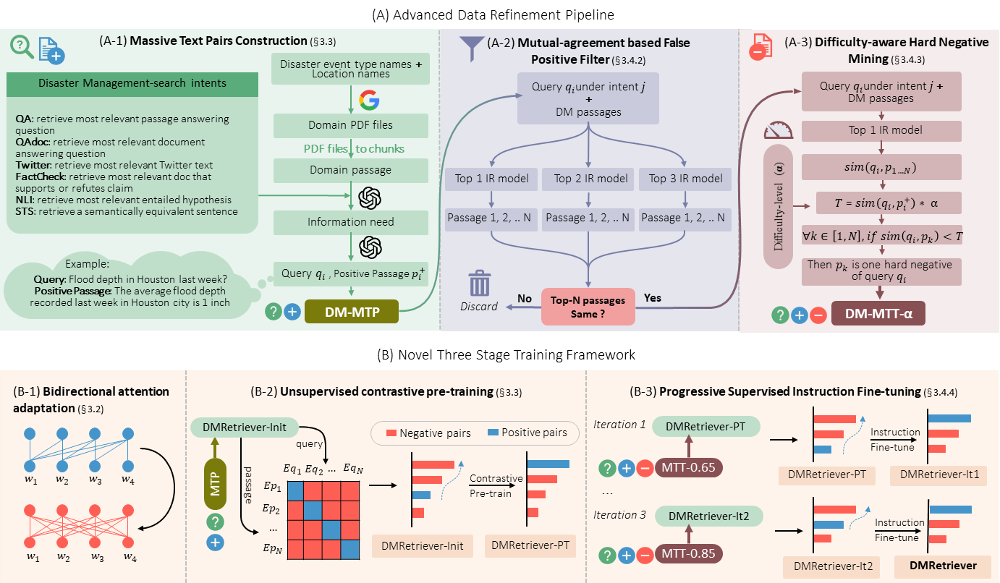

# 🧭 DMRetriever: A Family of Models for Improved Text Retrieval in Disaster Management  

## 📚 Table of Contents  
1. [Introduction](#-introduction)  
2. [Model Family](#-model-family)  
3. [Leaderboard](#-leaderboard)  
4. [Training Framework](#-three-stage-training-framework)  
5. [Evaluation](#-evaluation)  
6. [Datasets](#-training-validation-and-test-datasets)
8. [Model Checkpoints](#-model-checkpoints)
9. [Usage](#-usage)
10. [Citation](#-citation)
    

---

## 📖 Introduction  

Effective and efficient access to relevant information is essential for disaster management. However, no retrieval model is specialized for disaster management, and existing general-domain models fail to handle the varied search intents inherent to disaster management scenarios, resulting in inconsistent and unreliable performance. To this end, we introduce DMRetriever, the first series of dense retrieval models (33M to 7.6B) tailored for this domain. It is trained through a novel three-stage framework of bidirectional attention adaptation, unsupervised contrastive pre-training, and difficulty-aware progressive instruction fine-tuning, using high-quality data generated through an advanced data refinement pipeline. Comprehensive experiments demonstrate that DMRetriever achieves state-of-the-art (SOTA) performance across all six search intents at every model scale. Moreover, DMRetriever is highly parameter-efficient, with 596M model outperforming baselines over 13.3$	imes$ larger and 33M model exceeding baselines with only 7.6\% of their parameters.

<p align="center">
  
</p>

---

## 🚀 Model Family  

DMRetriever is released in multiple scales to support a range of deployment environments, from lightweight on-device use to high-capacity research applications:  

- **Small** (33M / 109M) — Lightweight models for resource-constrained or edge environments  
- **Medium** (335M) — Balanced accuracy and computational efficiency  
- **Large** (596M / 1.5B) — Strong performance with enhanced representational capacity  
- **XL** (4B / 7.6B) — The best-performing IR models

---

## 📊 Leaderboard  

*Results across six search intents at various scales in DisastIR-Test.*  
> **Notation:**  
> - **Bold** = best in size group  
> - <u>Underline</u> = second best  
> - `†` = statistically significant improvement (*p* < 0.05, one-tailed Wilcoxon signed-rank test)  

---

### 🧩 Small Size (≤109M)

| Model | Scale | QA | QAdoc | TW | FC | NLI | STS | Avg. |
|:--|:--:|:--:|:--:|:--:|:--:|:--:|:--:|:--:|
| thenlper-gte-small | 33M | 18.04 | 9.13 | 10.95 | 49.63 | 37.51 | 55.55 | 30.14 |
| arctic-embed-m | 109M | 33.15 | 14.04 | 8.48 | 35.07 | 38.67 | 56.20 | 30.94 |
| thenlper-gte-base | 109M | 9.18 | 5.42 | 37.91 | 60.45 | 42.52 | 46.07 | 33.59 |
| arctic-embed-m-v1.5 | 109M | 25.76 | 30.41 | 17.95 | 47.97 | 42.88 | 64.16 | 38.19 |
| arctic-embed-s | 33M | 38.58 | 28.81 | 21.33 | 47.21 | 39.85 | 66.96 | 40.46 |
| bge-small-en-v1.5 | 33M | 56.91 | 51.19 | 25.15 | 55.17 | 32.87 | 64.54 | 47.64 |
| bge-base-en-v1.5 | 109M | 51.50 | 52.78 | 46.72 | 59.93 | 41.16 | <u>68.63</u> | 53.45 |
| **DMRetriever-33M (ours)** | 33M | <u>62.47</u>† | <u>57.03</u>† | <u>57.22</u>† | <u>60.81</u>† | <u>46.56</u>† | 67.57 | <u>58.61</u>† |
| **DMRetriever-109M (ours)** | 109M | **63.19**† | **59.55**† | **58.88**† | **62.48**† | **46.93**† | **68.79**† | **59.97**† |

---

### ⚙️ Medium Size (137M–335M)

| Model | Scale | QA | QAdoc | TW | FC | NLI | STS | Avg. |
|:--|:--:|:--:|:--:|:--:|:--:|:--:|:--:|:--:|
| arctic-embed-m-long | 137M | 21.51 | 10.86 | 19.24 | 36.13 | 41.67 | 54.94 | 30.73 |
| arctic-embed-l | 335M | 40.56 | 30.19 | 14.98 | 32.64 | 34.20 | 56.10 | 34.78 |
| bge-large-en-v1.5 | 335M | 56.76 | 54.45 | 32.20 | 54.90 | 35.11 | 64.47 | 49.65 |
| gte-base-en-v1.5 | 137M | 60.51 | 55.62 | 46.26 | 52.24 | 39.59 | <u>70.40</u> | 54.10 |
| mxbai-embed-large-v1 | 335M | <u>64.24</u> | <u>62.63</u> | 39.94 | <u>58.12</u> | 40.18 | 68.01 | 55.52 |
| arctic-embed-m-v2.0 | 305M | 61.22 | 62.20 | <u>47.01</u> | 57.79 | <u>42.29</u> | 64.51 | <u>55.84</u> |
| **DMRetriever-335M (ours)** | 335M | **67.44**† | **62.69**† | **62.16**† | **64.42**† | **49.69**† | **70.71**† | **62.85**† |

---

### 🚀 Large Size (434M–1.5B)

| Model | Scale | QA | QAdoc | TW | FC | NLI | STS | Avg. |
|:--|:--:|:--:|:--:|:--:|:--:|:--:|:--:|:--:|
| arctic-embed-l-v2.0 | 568M | 55.23 | 59.11 | 38.11 | 60.10 | 41.07 | 62.61 | 52.70 |
| gte-large-en-v1.5 | 434M | 67.37 | 58.18 | 39.43 | 52.66 | 34.45 | 66.47 | 53.09 |
| Qwen3-Embedding-0.6B | 596M | 66.10 | 52.31 | 62.38 | 64.89 | 50.30 | 67.39 | 60.56 |
| mulling-e5-large-instruct | 560M | 67.97 | <u>64.64</u> | 62.25 | <u>66.78</u> | 48.51 | 63.42 | 62.26 |
| mulling-e5-large | 560M | 66.99 | 64.01 | 62.81 | 59.87 | 50.93 | <u>74.12</u> | 63.12 |
| gte-Qwen2-1.5B-instruct | 1.5B | <u>69.85</u> | 59.17 | <u>65.09</u> | 62.73 | <u>55.51</u> | 73.58 | 64.32 |
| inf-retriever-v1-1.5b | 1.5B | 69.41 | 64.29 | 62.99 | 65.39 | 54.03 | 73.92 | <u>65.01</u> |
| **DMRetriever-596M (ours)** | 596M | **72.44**† | **67.50**† | **65.79**† | **69.15**† | **55.71**† | **74.73**† | **67.55**† |

---

### 🧠 XL Size (≥4B)

| Model | Scale | QA | QAdoc | TW | FC | NLI | STS | Avg. |
|:--|:--:|:--:|:--:|:--:|:--:|:--:|:--:|:--:|
| Qwen3-Embedding-8B | 7.6B | 44.21 | 34.38 | 41.56 | 42.04 | 32.53 | 42.95 | 39.61 |
| gte-Qwen2-7B-instruct | 7.6B | 70.24 | 47.41 | 63.08 | 31.62 | 53.71 | 74.88 | 56.82 |
| NV-Embed-v1 | 7.9B | 68.06 | 62.70 | 56.02 | 59.64 | 48.05 | 67.06 | 60.26 |
| Qwen3-Embedding-4B | 4B | 67.20 | 59.14 | 65.28 | 67.16 | 53.61 | 58.51 | 61.82 |
| e5-mistral-7b-instruct | 7.1B | 65.57 | 64.97 | 63.31 | 67.86 | 47.55 | 66.48 | 62.58 |
| NV-Embed-v2 | 7.9B | 74.47 | 69.37 | 42.40 | 68.32 | <u>58.20</u> | 76.07 | 64.80 |
| inf-retriever-v1 | 7.1B | 72.84 | 66.74 | 66.23 | 65.53 | 51.86 | 75.98 | 66.53 |
| SFR-Embedding-Mistral | 7.1B | 71.41 | 67.14 | 69.45 | 70.31 | 50.93 | 72.67 | 66.99 |
| Linq-Embed-Mistral | 7.1B | 74.40 | 70.31 | 64.11 | 70.64 | 52.46 | 71.25 | 67.19 |
| **DMRetriever-4B (ours)** | 4B | <u>75.32</u>† | <u>70.23</u>† | <u>70.55</u>† | <u>71.44</u>† | 57.63 | <u>77.38</u>† | <u>70.42</u>† |
| **DMRetriever-7.6B (ours)** | 7.6B | **76.19**† | **71.27**† | **71.11**† | **72.47**† | **58.81**† | **78.36**† | **71.37**† |

---

## 🧩 Three-stage Training Framework  

DMRetriever is trained via a **three-stage pipeline** designed to adapt both encoder-only and decoder-only architectures effectively to disaster management domain:  

1. **Bidirectional Attention Adaptation**   
   - Script: `sh/PT_BiAttn_Ada.sh`  

2. **Unsupervised Contrastive Pre-training**  
   - Scripts:  
     - Decoder-only: `sh/PT_S2_decoder.sh`  
     - Encoder-only: `sh/PT_S2_encoder.sh`  

3. **Difficulty-aware Progressive Instruction Fine-tuning**  
   - Scripts:  
     - Decoder-only: `sh/FT_decoder.sh`  
     - Encoder-only: `sh/FT_encoder.sh`  

---

## 🧪 Evaluation  

DMRetriever provides flexible evaluation tools for both checkpoint-level and folder-level assessment:  

- **Evaluate multiple checkpoints** during training:  
  ```bash
  sh/Eva_ckpt_folder_level.sh
  ```
- **Evaluate a single checkpoint** on the test set:  
  ```bash
  sh/Eva_single_ckpt_level.sh
  ```

---

## 📂 Training, Validation, and Test Datasets

The **DisastIR** benchmark provides separate datasets for **training**, **validation**, and **testing**, designed to support both efficient model development and comprehensive evaluation.

- 🧠 **Training Set:**  
  Available at [**DMRetriever_MTT**](https://huggingface.co/datasets/DMIR01/DMRetriever_MTT).  
  This dataset is used for training retrieval and ranking models in the disaster domain.

- ⚙️ **Validation & Test Sets:**  
  Available at [**DisastIR-Devlite**](https://huggingface.co/datasets/DMIR01/DisastIR-DevLite).  
  It includes:
  - **DisastIR-Devlite** — a lightweight validation subset for rapid and reliable model development.  
  - **DisastIR-Test** — the official test set for final model evaluation on the full DisastIR corpus.

Together, these datasets form a **complete pipeline** for developing and benchmarking disaster-domain information retrieval systems —  
from training and validation to rigorous final testing.

---

## 💾 Model Checkpoints  

All models are publicly available in the following HuggingFace repository.

| **Model** | **Description** | **Backbone** | **Backbone Type** | **Hidden Size** | **#Layers** |
|:--|:--|:--|:--|:--:|:--:|
| [DMRetriever-33M](https://huggingface.co/DMIR01/DMRetriever-33M) | Base 33M variant | MiniLM | Encoder-only | 384 | 12 |
| [DMRetriever-33M-PT](https://huggingface.co/DMIR01/DMRetriever-33M-PT) | Pre-trained version of 33M | MiniLM | Encoder-only | 384 | 12 |
| [DMRetriever-109M](https://huggingface.co/DMIR01/DMRetriever-109M) | Base 109M variant | BERT-base-uncased | Encoder-only | 768 | 12 |
| [DMRetriever-109M-PT](https://huggingface.co/DMIR01/DMRetriever-109M-PT) | Pre-trained version of 109M | BERT-base-uncased | Encoder-only | 768 | 12 |
| [DMRetriever-335M](https://huggingface.co/DMIR01/DMRetriever-335M) | Base 335M variant | BERT-large-uncased-WWM | Encoder-only | 1024 | 24 |
| [DMRetriever-335M-PT](https://huggingface.co/DMIR01/DMRetriever-335M-PT) | Pre-trained version of 335M | BERT-large-uncased-WWM | Encoder-only | 1024 | 24 |
| [DMRetriever-596M](https://huggingface.co/DMIR01/DMRetriever-596M) | Base 596M variant | Qwen3-0.6B | Decoder-only | 1024 | 28 |
| [DMRetriever-596M-PT](https://huggingface.co/DMIR01/DMRetriever-596M-PT) | Pre-trained version of 596M | Qwen3-0.6B | Decoder-only | 1024 | 28 |
| [DMRetriever-4B](https://huggingface.co/DMIR01/DMRetriever-4B) | Base 4B variant | Qwen3-4B | Decoder-only | 2560 | 36 |
| [DMRetriever-4B-PT](https://huggingface.co/DMIR01/DMRetriever-4B-PT) | Pre-trained version of 4B | Qwen3-4B | Decoder-only | 2560 | 36 |
| [DMRetriever-7.6B](https://huggingface.co/DMIR01/DMRetriever-7.6B) | Base 7.6B variant | Qwen3-8B | Decoder-only | 4096 | 36 |
| [DMRetriever-7.6B-PT](https://huggingface.co/DMIR01/DMRetriever-7.6B-PT) | Pre-trained version of 7.6B | Qwen3-8B | Decoder-only | 4096 | 36 |
 
## 🚀 Usage  
Please refer to each model’s [Hugging Face page](https://huggingface.co/DMIR01) for specific usage instructions, including input format, embedding extraction, and evaluation examples.

---
## 🧾 Citation 

If you find this repository helpful, please kindly consider citing the corresponding paper as shown below. Thanks!

```bibtex
@article{yin2025dmretriever,
    title={DMRETRIEVER: A Family of Models for Improved Text Retrieval in Disaster Management},
    author={Yin, Kai and Dong, Xiangjue and Liu, Chengkai and Lin Allen and Shi, Lingfeng and Mostafavi, Ali and Caverlee, James},
    journal={arXiv preprint arXiv:2510.15087},
    year={2025}
}
